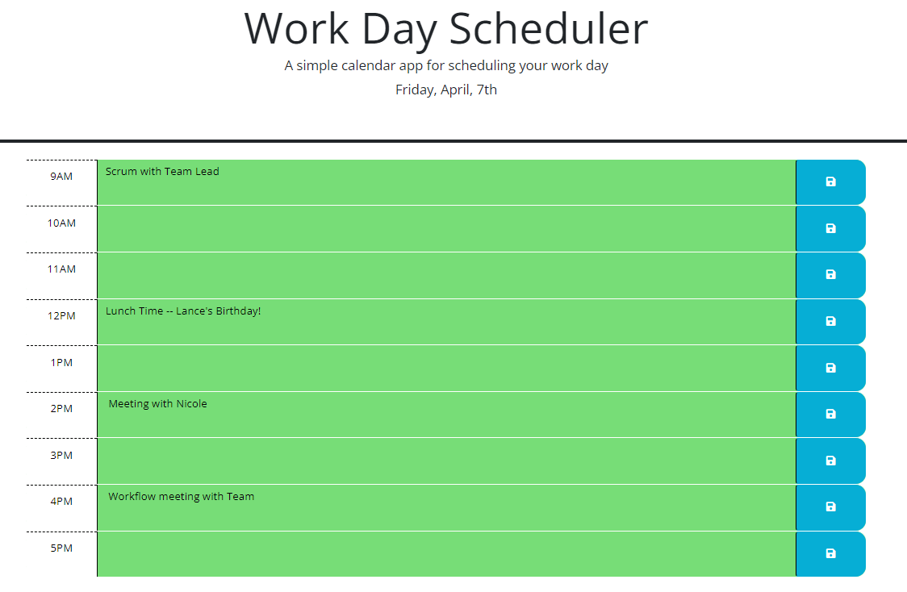

# Daily Scheduling App

## Table of Contents
- [Description](#description)
- [What was learned?](#what-was-learned)
- [Website](#website)
- [Credits](#credits)
 

## Description
This is a Daily Work planner used to block out time throughout your workday for Client meetings, Lunches and Programming times. The color of the Time Blocks are dynamic by choosing Gray, Red, or Green depending on whether the given time has already passed or not.
 

## What was learned?
While working on this project I learned how to effectively use Dayjs and take User inputs and save it into the Local Storage for future use. This is useful because when the user refreshes the page, the data will still be visible and not disappear.

 

## Website
[The link to the deployed webpage can be found here](https://angadbatth.github.io/daily-schedule-app/)

 

## Credits

[Mozilla Developer](https://developer.mozilla.org/en-US/)  
[W3 Schools](https://www.w3schools.com/)  
[Stack Overflow](https://stackoverflow.com/)  
Daler Singh  
Adam Nyx
